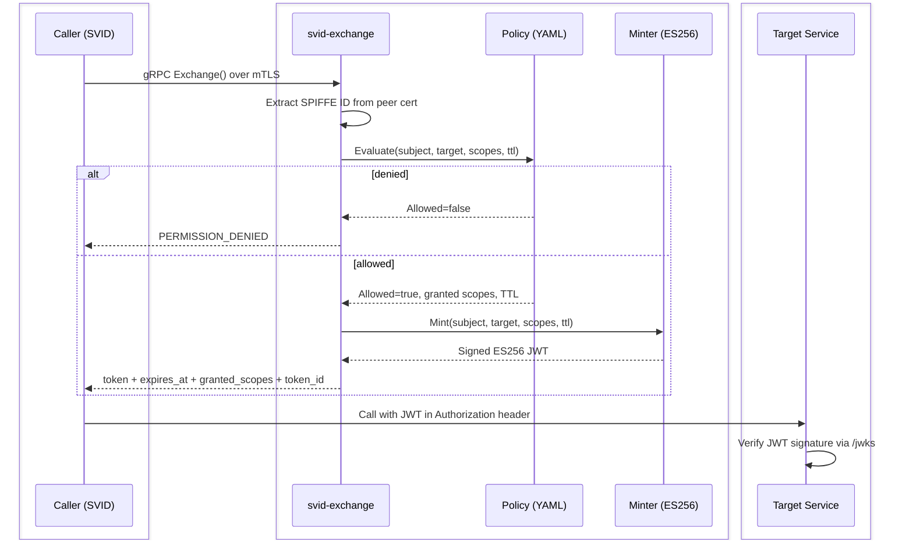
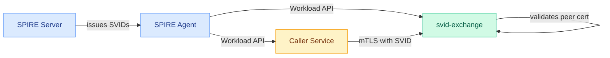

# Architecture

## Components

| Component | Role |
|-----------|------|
| **SPIRE Server** | Certificate authority; issues SVIDs to registered workloads |
| **SPIRE Agent** | Node-local daemon; attests workloads and serves the Workload API |
| **svid-exchange (gRPC)** | Token exchange service on `:8080`; validates identity, enforces policy, mints JWTs |
| **svid-exchange (HTTP)** | Health, JWKS, and metrics server on `:8081`; serves `/health/live`, `/health/ready`, `/jwks`, and `/metrics` |
| **Caller service** | Any SPIFFE-registered microservice requesting a token |
| **Target service** | The downstream service the caller wants to call; validates the JWT via `/jwks` |

## Token exchange flow

## mTLS and identity

svid-exchange uses the SPIRE Workload API (`X509Source`) to fetch and continuously rotate its own SVID. Every TLS handshake picks up the latest certificate without a process restart.

