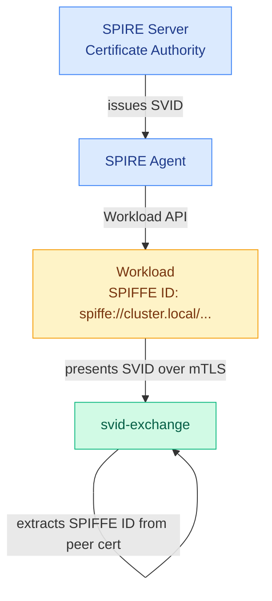

# Security

## Identity model

svid-exchange uses SPIFFE SVIDs as the root of trust. Every workload in the mesh is issued a cryptographic identity by SPIRE — a short-lived X.509 certificate with a SPIFFE URI in its Subject Alternative Name.



Critically, the caller's identity is extracted from the **TLS peer certificate** at the transport layer — not from the request body. There is no way for a caller to forge a different identity in the request payload.

## mTLS enforcement

All gRPC connections require mutual TLS with a valid SPIRE-issued client certificate. Connections without a client certificate are rejected before any application code runs.

svid-exchange uses the SPIRE Workload API (`go-spiffe` `X509Source`) to:
- Fetch its own SVID on startup
- Continuously rotate its certificate as SPIRE issues renewals
- Obtain the trust bundle to validate incoming client certificates

Every TLS handshake picks up the latest certificate. No process restart is needed when SVIDs rotate.

## JWT security properties

Tokens issued by svid-exchange are ES256 JWTs with the following security properties:

| Property | Detail |
|----------|--------|
| **Algorithm** | ES256 (ECDSA P-256) — no shared secret, asymmetric |
| **Audience** | Bound to a specific target SPIFFE ID — token cannot be replayed to a different service |
| **Scopes** | Limited to what the policy allows — caller cannot escalate |
| **TTL** | Capped by `max_ttl` in policy — no long-lived tokens |
| **JTI** | Unique UUID per token — enables future replay detection |

The signing key is an ephemeral ES256 key pair generated at startup. The corresponding public key is served at `/jwks` for downstream verification.

## Audit logging

Every exchange attempt is logged to stdout as structured JSON, regardless of outcome.

**Granted:**
```json
{
  "level": "info",
  "time": "...",
  "event": "token.exchange",
  "subject": "spiffe://cluster.local/ns/default/sa/order",
  "target": "spiffe://cluster.local/ns/default/sa/payment",
  "scopes_requested": ["payments:charge"],
  "granted": true,
  "scopes_granted": ["payments:charge"],
  "ttl": 300,
  "token_id": "<uuid>"
}
```

**Denied:**
```json
{
  "level": "info",
  "time": "...",
  "event": "token.exchange",
  "subject": "spiffe://cluster.local/ns/default/sa/order",
  "target": "spiffe://cluster.local/ns/default/sa/inventory",
  "scopes_requested": ["inventory:read"],
  "granted": false,
  "denial_reason": "no policy permits spiffe://.../order → spiffe://.../inventory"
}
```

## gRPC reflection

gRPC server reflection is enabled by default (useful for development with grpcurl). For production deployments, disable it:

```bash
GRPC_REFLECTION=false ./svid-exchange
```

When disabled, clients cannot enumerate available services or methods without the `.proto` file.
