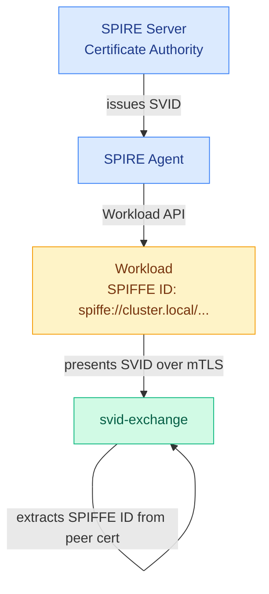

# Security

## Identity model

svid-exchange uses SPIFFE SVIDs as the root of trust. Every workload in the mesh is issued a cryptographic identity by SPIRE — a short-lived X.509 certificate with a SPIFFE URI in its Subject Alternative Name.



Critically, the caller's identity is extracted from the **TLS peer certificate** at the transport layer — not from the request body. There is no way for a caller to forge a different identity in the request payload.

## mTLS enforcement

All gRPC connections require mutual TLS with a valid SPIRE-issued client certificate. Connections without a client certificate are rejected before any application code runs.

svid-exchange uses the SPIRE Workload API (`go-spiffe` `X509Source`) to:
- Fetch its own SVID on startup
- Continuously rotate its certificate as SPIRE issues renewals
- Obtain the trust bundle to validate incoming client certificates

Every TLS handshake picks up the latest certificate. No process restart is needed when SVIDs rotate.

The minimum TLS version is **TLS 1.3** (`tls.VersionTLS13`). TLS 1.2 and below are rejected at the handshake.

## JWT security properties

Tokens issued by svid-exchange are ES256 JWTs with the following security properties:

| Property | Detail |
|----------|--------|
| **Algorithm** | ES256 (ECDSA P-256) — no shared secret, asymmetric |
| **Audience** | Bound to a specific target SPIFFE ID — token cannot be replayed to a different service |
| **Scopes** | Limited to what the policy allows — caller cannot escalate |
| **TTL** | Capped by `max_ttl` in policy — no long-lived tokens |
| **JTI** | Unique UUID per token — tracked server-side to detect replays |

Tokens are signed by a `token.Signer` implementation. The default is an in-process ES256 key pair generated at startup; see [KMS integration](#kms-integration) for keeping the private key off-disk. The corresponding public key (or keys, during a rotation window) is served at `/jwks` for downstream verification.

When `key_rotation_interval` is set in `config/server.yaml`, the minter generates a new key on that schedule. The outgoing key is retained and continues to appear in the `/jwks` response for one full interval, so tokens signed just before a rotation remain verifiable until they expire naturally. After the next rotation the old key is evicted — at most two keys are ever active at once. This bounds the exposure window of any single private key to one rotation interval.

### TTL and rotation interval

Token TTL and the rotation interval are independent settings, but they must be chosen together or a verification gap opens.

When a token is minted it is signed with the **current** key. That key survives in `/jwks` for exactly one rotation interval after it is displaced. A token minted at the start of an interval is still alive when the **second** rotation fires — and the key that signed it has just been evicted. Any downstream verifier that fetches `/jwks` at that point will find no key that validates the signature.

The safety invariant is:

```
key_rotation_interval  ≥  max_ttl (across all policies)
```

If the interval is shorter than the longest `max_ttl` in the policy file, tokens can outlive their signing key and become unverifiable before they expire. svid-exchange does not enforce this automatically; the operator is responsible for setting both values consistently.

Practical guidance:

| Policy `max_ttl` | Minimum `key_rotation_interval` | Typical production choice |
|---|---|---|
| 300 s (5 min) | 5 min | 24 h |
| 3 600 s (1 h) | 1 h | 12 h or 24 h |
| 86 400 s (1 day) | 24 h | 48 h |

> **Note:** The demo stack sets `key_rotation_interval: "5s"` with a policy `max_ttl` of 300 s solely to make the rotation mechanism visible during local testing. That combination is intentionally broken for demonstration purposes and must not be used in production.

### KMS integration

By default svid-exchange generates an ephemeral ES256 key pair in process. The private key lives in heap memory for the lifetime of the process. For environments that require the private key to never leave a hardware boundary (PCI-DSS, FIPS, regulated industries), svid-exchange exposes a `token.Signer` interface:

```go
type Signer interface {
    // Sign receives the SHA-256 digest of the JWT signing string and must
    // return the signature in IEEE P1363 format (r‖s, each 32 bytes for P-256).
    Sign(digest []byte) ([]byte, error)
    PublicKey() *ecdsa.PublicKey
}
```

Pass any implementation to `token.NewMinterFromSigner(s)` at startup. The rest of the service — JWKS endpoint, key rotation, Exchange handler — is unaffected.

**AWS KMS example** (using [aws-sdk-go-v2](https://github.com/aws/aws-sdk-go-v2)):

```go
type awsKMSSigner struct {
    client *kms.Client
    keyID  string
    pub    *ecdsa.PublicKey
}

func (s *awsKMSSigner) Sign(digest []byte) ([]byte, error) {
    out, err := s.client.Sign(context.Background(), &kms.SignInput{
        KeyId:            &s.keyID,
        Message:          digest,
        MessageType:      types.MessageTypeDigest,
        SigningAlgorithm: types.SigningAlgorithmSpecEcdsaSha256,
    })
    if err != nil {
        return nil, err
    }
    // KMS returns DER; JWT ES256 requires IEEE P1363.
    return token.DERToP1363(out.Signature, 32)
}

func (s *awsKMSSigner) PublicKey() *ecdsa.PublicKey { return s.pub }
```

Then wire it at startup:

```go
minter := token.NewMinterFromSigner(awsSigner)
```

For KMS-managed key rotation, call `minter.RotateTo(newSigner)` with a signer pointing at the new KMS key version. The previous public key is retained in `/jwks` for one rotation interval exactly as with in-process rotation.

The helper `token.DERToP1363(der []byte, coordLen int)` is exported for use in KMS adapter implementations — it converts the DER-encoded signature that AWS KMS and GCP Cloud KMS return into the IEEE P1363 format required by JWT ES256.

## Replay protection

After a token is minted, its `jti` (JWT ID) is recorded in an in-memory cache keyed by `jti → expiry`. On every subsequent `Exchange()` call, the freshly minted `jti` is checked against this cache before the response is returned:

- **New `jti`** — recorded in the cache and the token is returned normally.
- **Already-seen `jti`** — the call is rejected with `AlreadyExists`. No token is returned and no audit entry is written.

Cache entries are lazily swept when they expire, so the cache stays bounded to the set of currently-valid tokens. No background goroutine is required.

In practice, `jti` values are random UUIDs and collisions are statistically impossible. The cache acts as a defence-in-depth layer that catches hypothetical minter bugs or future non-UUID JTI schemes before they reach callers.

## Token revocation

A runtime revocation list complements the replay cache. An explicitly revoked `jti` is denied permanently — even within its original TTL — regardless of whether it has been seen before.

The check runs before the replay cache: if the freshly minted `jti` is on the revocation list, the call returns `PermissionDenied`.

Use `RevokeToken` on the admin gRPC API (`:8082`) to revoke a token by its `jti`. Pass the token's `expires_at` Unix timestamp (from the original `ExchangeResponse`) so the server can purge the entry automatically after the token has expired naturally. Revocations are persisted in BoltDB and survive server restarts — all non-expired entries are restored into the in-memory list on startup. Use `ListRevokedTokens` to inspect the currently active revocations.

## Rate limiting

Rate limiting is a second line of defence that operates independently of the policy layer. The policy controls *what* a workload may access; rate limiting controls *how often* it may ask.

Each SPIFFE ID gets its own independent token bucket. A compromised or misbehaving workload can only exhaust its own quota — other identities are unaffected. Requests that exceed the quota are rejected with `ResourceExhausted` before the policy or minting logic runs.

Rate limiting is opt-in via `rate_limit_rps` and `rate_limit_burst` in `config/server.yaml`. See [Rate Limiting](features/rate-limiting.md) for full configuration details and known limitations.

## Audit logging

Every exchange attempt is logged to stdout as structured JSON, regardless of outcome.

**Granted:**
```json
{
  "level": "info",
  "time": "...",
  "event": "token.exchange",
  "subject": "spiffe://cluster.local/ns/default/sa/order",
  "target": "spiffe://cluster.local/ns/default/sa/payment",
  "scopes_requested": ["payments:charge"],
  "granted": true,
  "scopes_granted": ["payments:charge"],
  "ttl": 300,
  "token_id": "<uuid>"
}
```

**Denied:**
```json
{
  "level": "info",
  "time": "...",
  "event": "token.exchange",
  "subject": "spiffe://cluster.local/ns/default/sa/order",
  "target": "spiffe://cluster.local/ns/default/sa/inventory",
  "scopes_requested": ["inventory:read"],
  "granted": false,
  "denial_reason": "no policy permits spiffe://.../order → spiffe://.../inventory"
}
```

### Audit log integrity

Plain JSON logs can be silently modified or deleted. When `AUDIT_HMAC_KEY` is set, each line is signed with HMAC-SHA256 and chained to the previous entry — any tampering or deletion is detectable offline.

```json
{
  "level": "info",
  "time": "...",
  "event": "token.exchange",
  "granted": false,
  "seq": 2,
  "prev_hmac": "6ecad2e0...",
  "hmac": "9a8fa214..."
}
```

See [Audit Log Integrity](features/audit-log-integrity.md) for how the signing works, how to verify logs offline, and the known limitations (key management, real-time prevention).

## Admin API access control

The admin gRPC service (`:8082`) can add and delete exchange policies, revoke tokens, and trigger policy reloads. Leaving it open to every authenticated SPIFFE peer is unsafe: a compromised workload could modify policy or freeze the mesh.

Configure an explicit allowlist in `config/server.yaml`:

```yaml
admin_subjects:
  - "spiffe://cluster.local/ns/ops/sa/policy-manager"
```

A gRPC unary interceptor extracts the caller's SPIFFE ID from the mTLS peer certificate — the same trust anchor used by the data-plane — and rejects any caller whose ID is not in the list with `PERMISSION_DENIED`. The TLS handshake guarantees that the SPIFFE ID cannot be forged.

When `admin_subjects` is empty the server emits a startup warning and allows any authenticated peer. This preserves backward compatibility but must not be used in production.

See [Configuration](configuration.md#admin-api-access-control) for the full `admin_subjects` reference.

## gRPC reflection

gRPC server reflection is enabled by default (useful for development with grpcurl). For production deployments, disable it in `config/server.yaml`:

```yaml
grpc_reflection: false
```

When disabled, clients cannot enumerate available services or methods without the `.proto` file.
