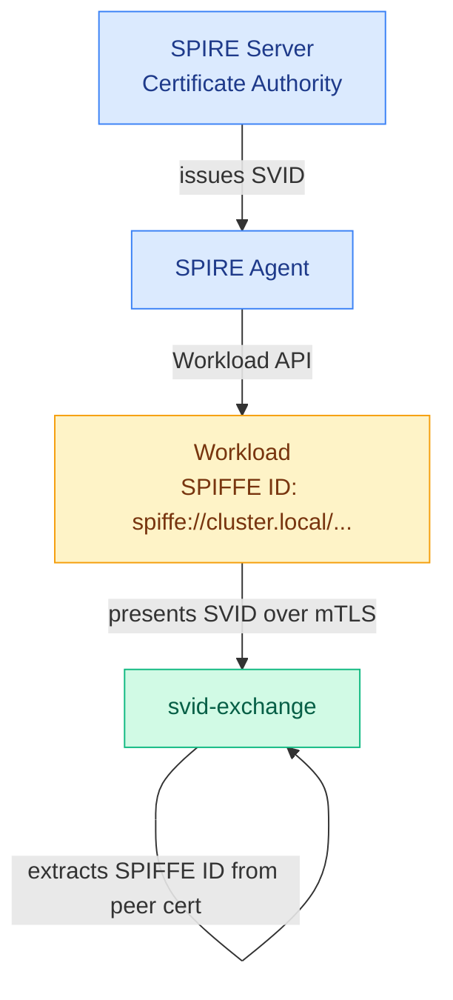

# Security

## Identity model

svid-exchange uses SPIFFE SVIDs as the root of trust. Every workload in the mesh is issued a cryptographic identity by SPIRE — a short-lived X.509 certificate with a SPIFFE URI in its Subject Alternative Name.



Critically, the caller's identity is extracted from the **TLS peer certificate** at the transport layer — not from the request body. There is no way for a caller to forge a different identity in the request payload.

## mTLS enforcement

All gRPC connections require mutual TLS with a valid SPIRE-issued client certificate. Connections without a client certificate are rejected before any application code runs.

svid-exchange uses the SPIRE Workload API (`go-spiffe` `X509Source`) to:
- Fetch its own SVID on startup
- Continuously rotate its certificate as SPIRE issues renewals
- Obtain the trust bundle to validate incoming client certificates

Every TLS handshake picks up the latest certificate. No process restart is needed when SVIDs rotate.

The minimum TLS version is **TLS 1.3** (`tls.VersionTLS13`). TLS 1.2 and below are rejected at the handshake.

## JWT security properties

Tokens issued by svid-exchange are ES256 JWTs with the following security properties:

| Property | Detail |
|----------|--------|
| **Algorithm** | ES256 (ECDSA P-256) — no shared secret, asymmetric |
| **Audience** | Bound to a specific target SPIFFE ID — token cannot be replayed to a different service |
| **Scopes** | Limited to what the policy allows — caller cannot escalate |
| **TTL** | Capped by `max_ttl` in policy — no long-lived tokens |
| **JTI** | Unique UUID per token — tracked server-side to detect replays |

The signing key is an ephemeral ES256 key pair generated at startup. The corresponding public key is served at `/jwks` for downstream verification.

## Replay protection

After a token is minted, its `jti` (JWT ID) is recorded in an in-memory cache keyed by `jti → expiry`. On every subsequent `Exchange()` call, the freshly minted `jti` is checked against this cache before the response is returned:

- **New `jti`** — recorded in the cache and the token is returned normally.
- **Already-seen `jti`** — the call is rejected with `AlreadyExists`. No token is returned and no audit entry is written.

Cache entries are lazily swept when they expire, so the cache stays bounded to the set of currently-valid tokens. No background goroutine is required.

In practice, `jti` values are random UUIDs and collisions are statistically impossible. The cache acts as a defence-in-depth layer that catches hypothetical minter bugs or future non-UUID JTI schemes before they reach callers.

## Token revocation

A runtime revocation list complements the replay cache. An explicitly revoked `jti` is denied permanently — even within its original TTL — regardless of whether it has been seen before.

The check runs before the replay cache: if the freshly minted `jti` is on the revocation list, the call returns `PermissionDenied`.

The revocation list is populated via `server.Revoke(jti string)`. The list starts empty and lives only in memory; entries are not persisted across restarts. A future endpoint on the admin service will provide an external interface to manage the revocation list at runtime.

## Rate limiting

Rate limiting is a second line of defence that operates independently of the policy layer. The policy controls *what* a workload may access; rate limiting controls *how often* it may ask.

Each SPIFFE ID gets its own independent token bucket. A compromised or misbehaving workload can only exhaust its own quota — other identities are unaffected. Requests that exceed the quota are rejected with `ResourceExhausted` before the policy or minting logic runs.

Rate limiting is opt-in via `RATE_LIMIT_RPS` and `RATE_LIMIT_BURST`. See [Rate Limiting](features/rate-limiting.md) for full configuration details and known limitations.

## Audit logging

Every exchange attempt is logged to stdout as structured JSON, regardless of outcome.

**Granted:**
```json
{
  "level": "info",
  "time": "...",
  "event": "token.exchange",
  "subject": "spiffe://cluster.local/ns/default/sa/order",
  "target": "spiffe://cluster.local/ns/default/sa/payment",
  "scopes_requested": ["payments:charge"],
  "granted": true,
  "scopes_granted": ["payments:charge"],
  "ttl": 300,
  "token_id": "<uuid>"
}
```

**Denied:**
```json
{
  "level": "info",
  "time": "...",
  "event": "token.exchange",
  "subject": "spiffe://cluster.local/ns/default/sa/order",
  "target": "spiffe://cluster.local/ns/default/sa/inventory",
  "scopes_requested": ["inventory:read"],
  "granted": false,
  "denial_reason": "no policy permits spiffe://.../order → spiffe://.../inventory"
}
```

### Audit log integrity

Plain JSON logs can be silently modified or deleted. When `AUDIT_HMAC_KEY` is set, each line is signed with HMAC-SHA256 and chained to the previous entry — any tampering or deletion is detectable offline.

```json
{
  "level": "info",
  "time": "...",
  "event": "token.exchange",
  "granted": false,
  "seq": 2,
  "prev_hmac": "6ecad2e0...",
  "hmac": "9a8fa214..."
}
```

See [Audit Log Integrity](features/audit-log-integrity.md) for how the signing works, how to verify logs offline, and the known limitations (key management, real-time prevention).

## gRPC reflection

gRPC server reflection is enabled by default (useful for development with grpcurl). For production deployments, disable it:

```bash
GRPC_REFLECTION=false ./svid-exchange
```

When disabled, clients cannot enumerate available services or methods without the `.proto` file.
